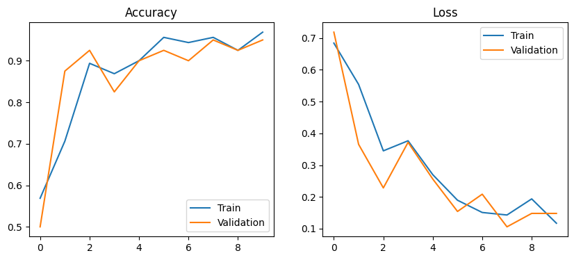
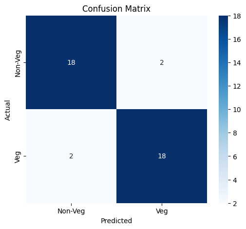
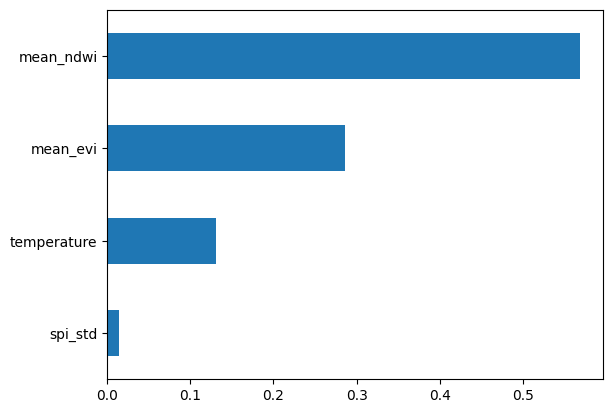
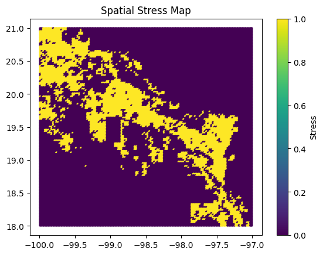
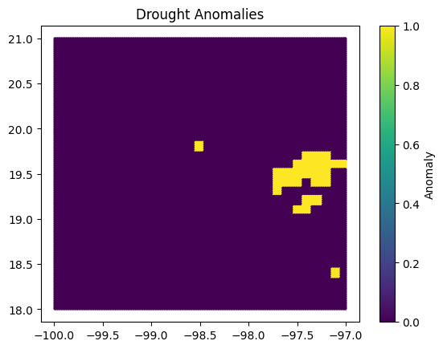
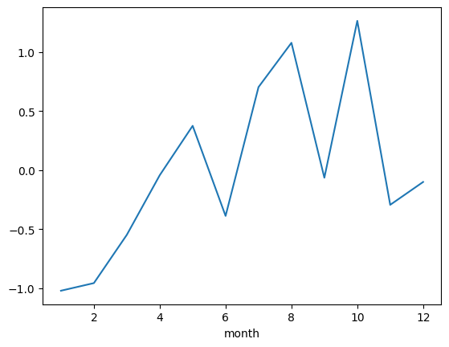

# Artificial Vision Final Project
## Detecting and Modeling Spatio-Temporal Environmental Stress Patterns
### Using Multi-Spectral Satellite Imagery to Support Water Equity Decision-Making


---

# 1. Project Overview

This project develops a complete artificial vision and multimodal environmental analysis pipeline for detecting vegetation conditions and drought-related stress using satellite imagery and atmospheric climate data.

The project integrates:

- Multi-band satellite image processing
- Vegetation/non-vegetation classification using a custom CNN
- Semi-supervised pseudo-labeling on unlabeled imagery
- ERA5 atmospheric drought analysis using SPI
- Vegetation index extraction using NDVI, NDWI, and EVI
- Multimodal climate–vegetation fusion
- Random Forest and XGBoost stress prediction
- Spatial drought/stress mapping and priority-risk ranking

---

# 2. Problem Statement

Large-scale satellite datasets often contain a small amount of manually labeled imagery and a large amount of unlabeled imagery. At the same time, vegetation degradation cannot always be explained from satellite images alone, because vegetation stress may be caused by:

- Prolonged low precipitation
- Elevated temperature
- Seasonal instability
- Human/environmental disturbance

This project addresses the following problem:

> How can satellite imagery and atmospheric data be combined to classify vegetation patterns and identify drought-related vegetation stress?

---

# 3. Project Objectives

1. Preprocess multi-band satellite imagery for computer vision analysis  
2. Classify vegetation and non-vegetation regions using a custom CNN  
3. Use semi-supervised pseudo-labeling to explore unlabeled imagery  
4. Compute drought indicators from ERA5 precipitation data  
5. Extract vegetation indices such as NDVI, NDWI, and EVI  
6. Merge satellite and climate datasets using spatial matching  
7. Build machine learning models for environmental stress prediction  
8. Generate quantitative metrics, maps, and feature-importance results  
9. Follow the full computer vision pipeline required in the course  

---

# 4. Dataset Description

## 4.1 Satellite Imagery

- **Source:** Sentinel-2 / Landsat Multispectral TIFF Imagery  
- **Acquisition Platform:** Google Earth Engine  
- **Dataset Link:**  
  - Sentinel-2 Harmonized: [View the Earth Engine Code](https://code.earthengine.google.com/57f295458a2a7c4d9310470e3eb3a161?noload=1)
 
- **Bands Used:**
  - Red
  - Green
  - Blue
  - Near Infrared (NIR)

---

## 4.2 Atmospheric Data

- **Source:** ERA5 Reanalysis Climate Data  
- **Provider:** ECMWF / Copernicus Climate Data Store  
- **Dataset Link:**  
  - ERA5 Monthly Reanalysis: [View the ERA5 Code](https://cds.climate.copernicus.eu/datasets/reanalysis-era5-single-levels-monthly-means?tab=download)

- **Variables Used:**
  - Precipitation
  - Temperature
  
## 4.3 Dataset Composition

| Data Type | Count |
|----------|------:|
| Total TIFF Images | 17,161 |
| Labeled Samples | 186 |
| Unlabeled Samples | 16,975 |

---

# Computer Vision Pipeline

---

## Step 0: Source Data to Image Representation

The project uses multispectral satellite imagery and atmospheric ERA5 climate data.

- Satellite data was already image-based in GeoTIFF format.
- ERA5 atmospheric data was converted into structured spatial-temporal features linked to image tile locations.

---

## Step 1: Image Preprocessing / Filtering

Preprocessing steps included:

- Loading multi-band GeoTIFF satellite images
- Splitting large images into smaller tiles
- Normalizing image bands
- Creating RGB / false-color previews
- Preparing 4-band image arrays for CNN input
- Saving intermediate outputs to avoid repeated computation

---

## Step 2: Feature Extraction / Representation Learning

### Spectral Feature Extraction

- NDVI
- NDWI
- EVI

### Deep Learning Feature Extraction

CNN convolutional layers automatically learned spatial features from the 4-band satellite tiles.

---

## Step 3: Analysis Models

Implemented models include:

- Custom CNN for vegetation/non-vegetation classification
- Semi-supervised pseudo-labeling using CNN predictions
- Random Forest for vegetation stress prediction
- XGBoost for additional stress modeling and comparison

---

## Step 4: Task Definition and Decision

### Task 1: Image Classification

- Vegetation
- Non-vegetation

### Task 2: Environmental Stress Classification

- Stressed Region
- Non-Stressed Region

---

## Step 5: Quantitative Assessment

Metrics used:

- Validation Accuracy
- Confusion Matrix
- Precision
- Recall
- F1-score
- Cross-Validation Accuracy
- Feature Importance Ranking
- Training/Validation Curves

---

## Step 6: Multimodal Interpretation

- SPI captures temporal drought trends
- CNN and vegetation indices capture spatial vegetation patterns
- Random Forest/XGBoost combine visual and atmospheric features for stress prediction

---

# 6. Methodology

---

## 6.1 Atmospheric Drought Analysis

### Standardized Precipitation Index (SPI)

```python
SPI = (precipitation - mean_precipitation) / std_precipitation
```

Additional climate metrics computed:

- Minimum SPI
- Mean Temperature
- SPI Standard Deviation
- Seasonal SPI Trends
- Drought Anomaly Indicators

---

## 6.2 Satellite Image Processing

Pipeline:

1. TIFF Loading  
2. Tile Generation  
3. RGB / False-Color Visualization  
4. Band Normalization  
5. Feature Extraction  
6. CNN Input Preparation  

---

## 6.3 Manual Labeling

A subset of image tiles was manually labeled into:

- Vegetation
- Non-Vegetation

These labels served as ground truth for supervised CNN training.

---

## 6.4 CNN-Based Vegetation Classification

A custom CNN was built from scratch using TensorFlow/Keras.

### CNN Architecture

- Conv2D (32 Filters)
- MaxPooling
- Conv2D (64 Filters)
- MaxPooling
- Conv2D (128 Filters)
- MaxPooling
- Flatten
- Dense
- Dropout
- Sigmoid Output

### Training Setup

| Component | Value |
|----------|------|
| Loss Function | Binary Crossentropy |
| Optimizer | Adam |
| Output Activation | Sigmoid |
| Task | Binary Classification |

---

## 6.5 Semi-Supervised Pseudo-Labeling

Process:

1. Train baseline CNN  
2. Predict unlabeled images  
3. Accept high-confidence predictions  
4. Convert predictions into pseudo-labels  
5. Retrain CNN  

### Confidence Thresholds

| Prediction Score | Assigned Label |
|-----------------|---------------|
| > 0.95 | Vegetation |
| < 0.05 | Non-Vegetation |

---

## 6.6 Multimodal Climate–Vegetation Fusion

Merged Features:

- NDVI
- NDWI
- EVI
- Minimum SPI
- Temperature
- SPI Standard Deviation

Spatial merging performed using nearest-neighbor geographic matching.

---

## 6.7 Stress Label Definition

```python
stress = (
    (mean_ndvi < 0.3) &
    (spi_min < -1) &
    (spi_std > 0.5)
)
```

Stress criteria:

- Weak Vegetation
- Drought Present
- Unstable Climate

---

## 6.8 Stress Prediction Model

Models:

- Random Forest
- XGBoost

Input Features:

- Mean NDVI
- Mean EVI
- Temperature
- SPI Standard Deviation

Evaluation:

- Classification Report
- Confusion Matrix
- Cross-Validation
- Feature Importance

---

## 6.9 Priority Risk Mapping

```python
priority_score =
    (-spi_min * 0.5) +
    (spi_std * 0.3) +
    ((1 - mean_ndvi) * 0.2)
```

Used to rank drought/stress severity.

---

# 7. Experiments and Results

## 7.1 CNN Classification Results
### CNN Training Curves

The CNN training process showed strong convergence behavior with increasing accuracy and decreasing loss across training epochs.

The similarity between training and validation curves suggests that the model generalized well without severe overfitting.



## 7.2 CNN Vegetation Classification Results

| Experiment | Validation Accuracy |
|-----------|--------------------|
| Baseline CNN | 95.0% |
| CNN + 50 Pseudo Labels | 92.5% |
| CNN + 300 Pseudo Labels | 87.5% |

---

### CNN Confusion Matrix

| Result Type | Count |
|------------|------|
| True Non-Vegetation Correct | 18 |
| False Positive | 2 |
| False Negative | 2 |
| True Vegetation Correct | 18 |



---

## 7.3 CNN Classification Report

| Metric | Value |
|-------|------|
| Precision | 0.90 |
| Recall | 0.90 |
| F1-score | 0.90 |
| Accuracy | 0.90 |

---

## 7.4 Stress Prediction Results

| Metric | Value |
|-------|------|
| Accuracy | ~97% |
| Cross-Validation Mean Accuracy | ~92.8% |

----

## 7.5 Random Forest Feature Importance

A Random Forest classifier was implemented to predict environmental stress using multimodal features derived from satellite vegetation indices and atmospheric data.

The feature importance results showed:

| Feature | Importance |
|---|---:|
| Mean NDWI | 0.473929 |
| Mean EVI | 0.362667 |
| Temperature | 0.163403 |

This indicates that NDWI contributed the most to the stress prediction model, followed by EVI and temperature.

The result suggests that water-related vegetation/moisture information played the strongest role in identifying stressed regions in this experiment.

Feature importance visualization:


---

## 7.6 Spatial Stress Mapping and Drought Anomaly Detection

Spatial stress maps and drought anomaly maps were generated using the merged multimodal dataset.

The generated maps highlighted:

- regions with severe drought conditions,
- regions with weak vegetation health,
- and regions with combined climate instability and vegetation degradation.

The priority risk mapping framework allowed stressed regions to be ranked based on:

- SPI severity,
- vegetation condition,
- and climate variability.

Generated outputs included:

- Stress maps
- Drought anomaly maps
- Priority risk ranking maps

Example outputs:





---
## 7.7 Relationship Between SPI and Vegetation Stress

The project explored the relationship between atmospheric drought conditions and vegetation stress.

SPI was used to characterize temporal drought severity, while vegetation indices and CNN outputs described spatial vegetation conditions.

The multimodal analysis revealed that:

- several low-vegetation regions also exhibited severe drought conditions,
- while some vegetation-stressed regions did not correspond to strong drought signals.

This suggests that vegetation degradation may result from multiple interacting factors, including:

- drought,
- temperature variation,
- land-use changes,
- agricultural activity,
- or environmental disturbance.

The integration of SPI and vegetation analysis therefore provided stronger environmental interpretation than using imagery alone.

---
### Temporal SPI Trend

Monthly SPI averages were computed to analyze the temporal evolution of drought conditions throughout the study period.

The SPI trend demonstrates changing atmospheric moisture conditions across the year, including:

- dry periods (negative SPI),
- neutral periods,
- and wetter periods (positive SPI).

This temporal analysis was important because vegetation stress often results from prolonged atmospheric conditions rather than a single observation period.

Temporal SPI visualization:



---

## 7.8 Feature Importance Ranking

1. NDVI  
2. EVI  
3. Temperature  
4. SPI Variability  

---

# 8. Key Findings

- Baseline CNN successfully classified vegetation/non-vegetation
- Semi-supervised pseudo-labeling did not improve performance
- Excess pseudo-labeling introduced noise
- SPI provided temporal drought context
- Climate fusion improved environmental interpretation
- Stress models identified high-risk regions effectively

---

# 9. Computational Challenges

Challenges encountered:

- Large TIFF image sizes
- Limited Colab runtime stability
- Slow Google Drive I/O
- High memory cost for large-scale pseudo-labeling

Mitigation:

- Batch Processing
- Subset Experiments
- Persistent Caching
- Saving Intermediate Arrays

---

# 10. Generated Outputs

- RGB / False-Color Previews
- CNN Training Curves
- Confusion Matrices
- Classification Reports
- Pseudo-Label Comparison Table
- Drought Anomaly Maps
- Stress Maps
- Priority Risk Rankings
- Feature Importance Plots

---

# 11. Repository Structure

```text
artificial-vision-final-project/
│
├── README.md
├── requirements.txt
│
├── notebooks/
│   ├── 01_data_preprocessing.ipynb
│   ├── 02_spi_analysis.ipynb
│   ├── 03_cnn_training.ipynb
│   ├── 04_pseudo_labeling.ipynb
│   ├── 05_multimodal_fusion.ipynb
│   └── 06_stress_modeling_and_evaluation.ipynb
│
├── src/
├── data/
├── models/
├── results/
└── figures/
```

---

# 12. How to Run

## Install Dependencies

```bash
pip install -r requirements.txt
```

## Run Order

1. `01_data_preprocessing.ipynb`  
2. `02_spi_analysis.ipynb`  
3. `03_cnn_training.ipynb`  
4. `04_pseudo_labeling.ipynb`  
5. `05_multimodal_fusion.ipynb`  
6. `06_stress_modeling_and_evaluation.ipynb`  

---

# 13. Limitations

- Small labeled dataset
- Pseudo-labeling introduced noise
- Full 17k-scale processing limited by compute resources
- LSTM temporal modeling was unstable
- Spatial climate-image matching used nearest-neighbor approximation

---

# 14. Future Work

- More manually labeled data
- Improved pseudo-label filtering
- Active Learning
- Transfer Learning for Multispectral Data
- Better Temporal Alignment
- LSTM/Transformer Temporal Forecasting
- GPU Deployment
- Dashboard Deployment

---

# 15. Conclusion

This project demonstrates a complete artificial vision and multimodal environmental analysis pipeline combining:

- Satellite Image Processing
- CNN-Based Vegetation Classification
- Semi-Supervised Learning
- SPI Drought Analysis
- Climate–Vegetation Fusion
- Machine Learning Stress Prediction

Together, these provide a stronger framework for identifying vegetation stress and prioritizing high-risk environmental regions.

---

# 16. Author

**Peace Ebika**  
Artificial Vision Final Project  
Universidad de las Americas Puebla

---
